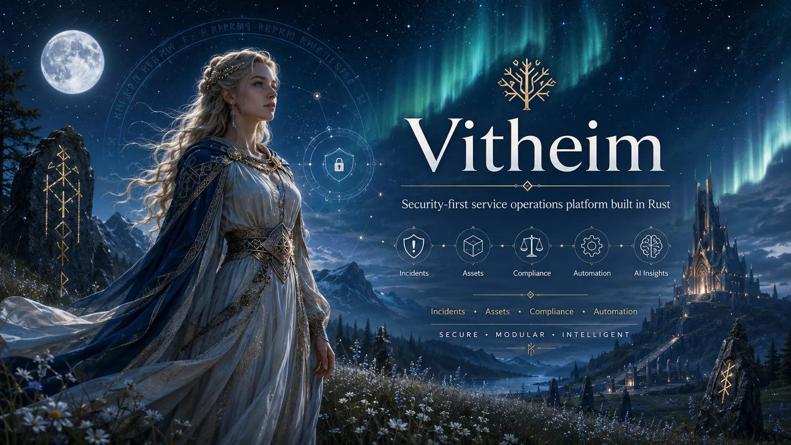

<p align="center">
  <b>Security-first service operations, evidence, and automation platform in Rust.</b><br>
  Built as small private <code>no_std</code> foundations surrounded by explicit hosted boundaries, with every release independently testable and pentestable.
</p>

<div align="center">
  <a href="https://github.com/valkyoth/vitheim/blob/main/docs/RELEASE_PLAN.md">Release Plan</a>
  |
  <a href="https://github.com/valkyoth/vitheim/blob/main/docs/ARCHITECTURE.md">Architecture</a>
  |
  <a href="https://github.com/valkyoth/vitheim/blob/main/docs/THREAT_MODEL.md">Threat Model</a>
  |
  <a href="https://github.com/valkyoth/vitheim/blob/main/SECURITY.md">Security</a>
</div>

<br>

<p align="center">
  <a href="https://github.com/valkyoth/vitheim">
    
  </a>
</p>

# Vitheim

Vitheim is a planned service-operations platform for incidents, requests,
changes, assets and service graphs, security operations, risk and compliance,
knowledge, vulnerability management, composable dashboards, durable workflows,
on-call/paging, service health and reliability objectives, governed WASM
plugins/connectors, optional organization federation, policy-controlled
automation, and optional untrusted AI assistance. It is
API-first: the first-party interface is a separately bounded API client, not a
privileged path into domain or storage code.

The current `0.1.0` workspace is only the repository and security baseline. It
contains dependency-free private `no_std` foundation crates; it is not a
server, product preview, SDK, database, ITSM implementation, or production
release. Capability claims advance only through the granular
[release plan](docs/RELEASE_PLAN.md).

## Current Status

Legend: 🟢 available for the stated scope, 🟡 foundation only, 🔴 planned.

| Capability | Status | Current scope |
| --- | --- | --- |
| Auditable Rust workspace | 🟢 | Rust 1.97.1, Rust 2024, strict lints, CI, security and release policy |
| Dependency-free `no_std` foundation | 🟢 | Opaque ID storage, injected time, stable error categories, and explicit limits |
| Multi-platform core | 🟢 | CI check targets for Linux, Windows, FreeBSD, NetBSD, macOS, Android, and iOS |
| Command/event kernel | 🔴 | Planned for `0.7.0` through `0.10.0` |
| Storage and projections | 🔴 | Planned for `0.11.0` through `0.30.0` |
| ITSM, assets, SecOps, compliance | 🔴 | Planned as separate bounded release phases |
| Workflows, policies, search, WASM, AI | 🔴 | Planned behind deterministic and capability-limited interfaces |
| API-first composable UI and federation | 🔴 | Planned as separate API/UI crates, governed layout blocks, and optional bilateral trust |
| Production platform | 🔴 | Requires the complete `1.0.0` acceptance gate and external pentest |

## Workspace

All packages are private and set `publish = false`:

| Crate | Layer | Purpose |
| --- | --- | --- |
| `vitheim` | N0 facade | Stable import surface for admitted deterministic foundations |
| `vitheim-id` | N0 | Fixed-width identifier representation; typed domains arrive in `0.2.0` |
| `vitheim-time` | N0 | Host-injected time values with no ambient clock access |
| `vitheim-error` | N0 | Stable non-sensitive error categories and codes |
| `vitheim-budget` | N0 | Explicit non-zero bounds for attacker-controlled work |

N0 crates use neither `std` nor an allocator. Later N1 crates may use `alloc`
but remain OS-independent. Hosted crates may use `std` only at named I/O,
storage, protocol, runtime, or product boundaries. Dependency direction always
points inward.

## Development

Use the pinned toolchain and run the complete local gate:

```bash
scripts/checks.sh
```

Check networked tool freshness regularly and before a release:

```bash
scripts/check_latest_tools.sh
```

Generate an SPDX SBOM for release evidence:

```bash
scripts/generate-sbom.sh --write
scripts/generate-sbom.sh --check
```

## Security And Publication

Security is the primary design constraint. Every change must preserve tenant
isolation, bounded untrusted input, deterministic inner logic, explicit
authorization, immutable event history, and truthful capability claims.

No crate in this repository may be published to crates.io. There is no
publication workflow or token path. A future SDK may be split out and licensed
under MIT OR Apache-2.0 only after an explicit design, security, compatibility,
and licensing decision. See [Publication Policy](docs/PUBLICATION_POLICY.md).

## Documentation

- [Architecture](docs/ARCHITECTURE.md)
- [Implementation Plan — all 221 milestones](docs/IMPLEMENTATION_PLAN.md)
- [Release Plan](docs/RELEASE_PLAN.md)
- [Roadmap Gap Dispositions](docs/ROADMAP_GAP_DISPOSITIONS.md)
- [Modularity Policy](docs/MODULARITY_POLICY.md)
- [Security Controls](docs/SECURITY_CONTROLS.md)
- [Threat Model](docs/THREAT_MODEL.md)
- [Supply-Chain Security](docs/SUPPLY_CHAIN_SECURITY.md)
- [Toolchain Policy](docs/TOOLCHAIN_POLICY.md)
- [Initial Idea And Discussion](docs/INITIAL_IDEA.md)

## License

Vitheim is licensed under the [European Union Public Licence 1.2](LICENSE).
A future separately scoped SDK may use MIT OR Apache-2.0 only after explicit
approval; that exception does not apply to the platform or current crates.
